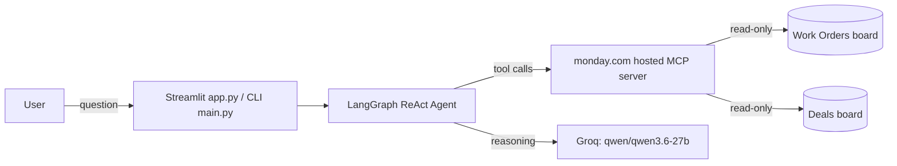

# Skylark Drones — Business Intelligence Agent

A conversational agent that answers founder-level business questions by
querying two monday.com boards (Work Orders and Deals) live — no cached
or hardcoded data. 

**Hosted app:** https://business-intelligence-agent-j4bpbxcfqj5q8fecgpka6h.streamlit.app/

## Architecture



- **UI layer** — `app.py` (Streamlit, hosted) and `main.py` (CLI, for local
  testing). Both share the same agent and conversation-capping logic.
- **Agent layer** — `agent.py` builds a LangGraph `create_react_agent`
  bound to a Groq-hosted LLM and a filtered set of monday MCP tools. The
  system prompt encodes both boards' schema, the cross-board join logic,
  and known data-quality caveats.
- **Integration layer** — `mcp_tools.py` connects to monday's hosted MCP
  server (`streamable_http`) and hands the agent only a read-only
  allowlist of tools (`get_board_info`, `execute_code`) — enforced in
  code, not just via the token's permission scope.
- **Config** — `config.py` centralizes board IDs, column ID mappings, and
  the list of known data-quality issues surfaced to the model.

See `DECISION_LOG.md`-equivalent (`Decision_Log.docx`) for the reasoning
behind these choices and their trade-offs.

## monday.com setup

1. **Import the data as two separate boards**:
   - `Work_Order_Tracker Data.xlsx` → a board named e.g. **Work Orders**
   - `Deal funnel Data.xlsx` → a board named e.g. **Deals**
   - Column types don't need to match exactly what's below — the agent
     reads whatever column IDs you configure (see step 3).

2. **Generate a monday.com API token** with read-only access (Admin →
   API in monday.com, or a personal token scoped to read). This project
   never calls write/mutation endpoints, but scope the token itself as
   read-only too, as a second layer of protection.

3. **Get each board's ID** from its URL:
   `https://yourteam.monday.com/boards/1234567890` → `1234567890`.

4. **Map your column IDs.** Column IDs are auto-generated by monday and
   will differ from the ones already in `config.py` unless you're using
   the exact same import. To find yours:
   - Run `test_connection.py` (calls `get_board_info` on the Work Orders
     board), or
   - Use `get_deals_columns.py` (included) to dump any board's columns
     as a ready-to-paste Python dict.

   Update `WORK_ORDERS_COLUMNS` and `DEALS_COLUMNS` in `config.py`
   accordingly, and update the join column references in `agent.py`'s
   `SYSTEM_PROMPT` if your customer/client identifier columns differ.

## Environment variables

Create a `.env` file in the project root (never commit this):

```
MONDAY_TOKEN=your_monday_api_token
GROQ_API_KEY=your_groq_api_key
WORK_ORDERS_BOARD_ID=your_work_orders_board_id
DEALS_BOARD_ID=your_deals_board_id
```

For the **hosted Streamlit version**, these same four values are set in
Streamlit Cloud's **Secrets** manager instead of a `.env` file (Settings →
Secrets, in the same `KEY=value` format).

## Running locally

```bash
python -m venv venv
source venv/bin/activate      # Windows: venv\Scripts\activate
pip install -r requirements.txt

# CLI:
python main.py

# Streamlit UI:
streamlit run app.py
```


## Verifying the setup before trusting the agent's answers

- `test_connection.py` — confirms the MCP connection and token work, and
  does a raw pull from the Work Orders board.


## Known constraints

- **Groq free tier**: the LLM is rate-limited to 8,000 tokens/minute.
  The system prompt, tool schemas, and conversation history are all kept
  deliberately tight to stay under this. Upgrading to Groq's
  Developer tier removes this constraint.
- **Read-only by design**: the agent cannot create, update, or delete
  monday.com data, even if asked. Data-quality issues are surfaced as
  caveats in its answers, not silently auto-corrected on the board.
